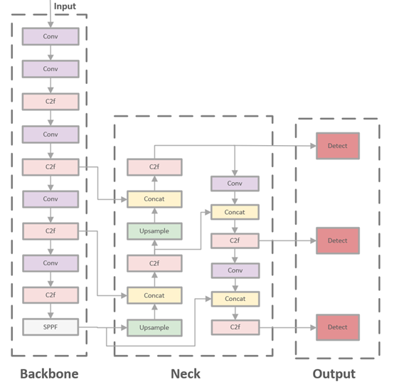

##  YOLOv8n-DDSW：An efficient fish target detection network for dense underwater scenes

### 1. YOLOv8



The YOLOv8 object detection algorithm was released by the ultralytics team in 2023. It adopts a top-down convolutional neural network structure, which can efficiently detect a wide variety of objects and support multi-class classification tasks. YOLOv8 has the following improvements over other YOLO series algorithms:

1. **Backbone**：The backbone part uses the C2f module, which has more residual connections and can obtain richer gradient information. 
2. **Head**：The Head part uses a decoupled head to separate the classification and detection tasks. 
3. **Anchor-Free**：The anchor box is discarded and an Anchor-Free structure is used to reduce the complexity of the algorithm.
4. **Loss function**：BCE Loss is used as the classification loss and DFL Loss + CIOU Loss as the regression loss.
   
+ **YOLOv8 model configuration file**
```python
# YOLOv8.0n backbone
backbone:
  # [from, repeats, module, args]
  - [-1, 1, Conv, [64, 3, 2]] # 0-P1/2
  - [-1, 1, Conv, [128, 3, 2]] # 1-P2/4
  - [-1, 3, C2f, [128, True]]
  - [-1, 1, Conv, [256, 3, 2]] # 3-P3/8
  - [-1, 6, C2f, [256, True]]
  - [-1, 1, Conv, [512, 3, 2]] # 5-P4/16
  - [-1, 6, C2f, [512, True]]
  - [-1, 1, Conv, [1024, 3, 2]] # 7-P5/32
  - [-1, 3, C2f, [1024, True]]
  - [-1, 1, SPPF, [1024, 5]] # 9

# YOLOv8.0n head
head:
  - [-1, 1, nn.Upsample, [None, 2, "nearest"]]
  - [[-1, 6], 1, Concat, [1]] # cat backbone P4
  - [-1, 3, C2f, [512]] # 12

  - [-1, 1, nn.Upsample, [None, 2, "nearest"]]
  - [[-1, 4], 1, Concat, [1]] # cat backbone P3
  - [-1, 3, C2f, [256]] # 15 (P3/8-small)

  - [-1, 1, Conv, [256, 3, 2]]
  - [[-1, 12], 1, Concat, [1]] # cat head P4
  - [-1, 3, C2f, [512]] # 18 (P4/16-medium)

  - [-1, 1, Conv, [512, 3, 2]]
  - [[-1, 9], 1, Concat, [1]] # cat head P5
  - [-1, 3, C2f, [1024]] # 21 (P5/32-large)

  - [[15, 18, 21], 1, Detect, [nc]] # Detect(P3, P4, P5)
```
+ **C2f**
The C2f module is designed with reference to the C3 module and the idea of ELAN, so that YOLOv8 can obtain richer gradient flow information while ensuring lightweight.

The Pytorch implementation corresponding to the C2f module is as follows：

```python
class C2f(nn.Module):
    # CSP Bottleneck with 2 convolutions
    def __init__(self, c1, c2, n=1, shortcut=False, g=1, e=0.5):  # ch_in, ch_out, number, shortcut, groups, expansion
        super().__init__()
        self.c = int(c2 * e)  # hidden channels
        self.cv1 = Conv(c1, 2 * self.c, 1, 1)
        self.cv2 = Conv((2 + n) * self.c, c2, 1)  # optional act=FReLU(c2)
        self.m = nn.ModuleList(Bottleneck(self.c, self.c, shortcut, g, k=((3, 3), (3, 3)), e=1.0) for _ in range(n))

    def forward(self, x):
        y = list(self.cv1(x).split((self.c, self.c), 1))
        y.extend(m(y[-1]) for m in self.m)
        return self.cv2(torch.cat(y, 1))
```


+ **YOLOv8 loss function**

YOLOv8 uses CIOU for calculating the regression loss of the bounding box. This loss function evaluates the resemblance between two bounding boxes based on the position, size and angle differences between them and calculates positioning loss.


 b^A and b^B represent the centroids of prediction and real frames, respectively; ρ stands for the Euclidean distance between both points; ρ denotes the diagonal length of the smallest outer rectangle of prediction and real frames; α refers to a balancing parameter. 


### 2.YOLOv8n-DDSW
The YOLOv8n-DDSW object detection algorithm has been improved as follows: (1) deformable convolution is introduced into the backbone C2f structure; (2) the DPSE channel attention mechanism is introduced at the Neck end; (3) a small object detection head is introduced at the Head end; (4) the Wise-IOU loss function is used instead of the original loss function.


+ **C2f-DCN**
 The standard convolution in C2f is only suitable for detecting some static targets with regular shapes and low complexity. Therefore, deformable convolution and deformable pooling are introduced into the bottleneck structure of C2f.

The Pytorch implementation corresponding to the C2f_DCN module is as follows：

```python
backbone:
  # [from, repeats, module, args]
  - [-1, 1, Conv, [64, 3, 2]]  
  - [-1, 1, Conv, [128, 3, 2]]  
  - [-1, 3, C2f_DCN, [128, True]]
  - [-1, 1, Conv, [256, 3, 2]]  
  - [-1, 6, C2f_DCN, [256, True]]
  - [-1, 1, Conv, [512, 3, 2]]  
  - [-1, 6, C2f_DCN, [512, True]]
  - [-1, 1, Conv, [1024, 3, 2]]  
  - [-1, 3, C2f_DCN, [1024, True]]
  - [-1, 1, SPPF, [1024, 5]]  

```
```python
class C2f_DCN(nn.Module):
    # CSP Bottleneck with 2 convolutions
    def __init__(self, c1, c2, n=1, shortcut=False, g=1, e=0.5):  # ch_in, ch_out, number, shortcut, groups, expansion
        super().__init__()
        self.c = int(c2 * e)  # hidden channels
        self.cv1 = Conv(c1, 2 * self.c, 1, 1)
        self.cv2 = Conv((2 + n) * self.c, c2, 1)  # optional act=FReLU(c2)
        self.m = nn.ModuleList(Bottleneck_DCN(self.c, self.c, shortcut, g, k=(3, 3), e=1.0) for _ in range(n))

    def forward(self, x):
        y = list(self.cv1(x).split((self.c, self.c), 1))
        y.extend(m(y[-1]) for m in self.m)
        return self.cv2(torch.cat(y, 1)) 

```
+ **DPSE attention mechanism**  
Hu et al. proposed the Squeeze-and-Excitation (SE) channel attention mechanism. It enhances the model's performance by adaptively adjusting the feature weights at the channel level to establish the interrelationships between channels. This experiment improves the SE attention mechanism by combining average pooling and max pooling in a two-channel pooling layer.
+ **Small-detect**  
The original YOLOv8 algorithm sets up three detection heads to detect large, medium and small targets respectively. The input size is a feature map of 640 × 640. After several downsampling steps, the feature maps at the detection layers are 20 × 20, 40 × 40 and 80 × 80, respectively, and are responsible for detecting large targets above 32 × 32, medium targets above 16 × 16 and small targets above 8 × 8. This algorithm model adds a small target detection layer with a feature map of 160 × 160 to detect small targets above 4 × 4.
  The Pytorch implementation corresponding to the DPSE module and Small-detect module is as follows：
```python
head:
  - [-1, 1, nn.Upsample, [None, 2, 'nearest']]
  - [[-1, 6], 1, Concat, [1]]  
  - [-1, 3, C2f, [512]]  

  - [-1, 1, nn.Upsample, [None, 2, 'nearest']]
  - [[-1, 4], 1, Concat, [1]]  
  - [-1, 3, C2f, [256]]  

  - [-1, 1, nn.Upsample, [None, 2, 'nearest']]
  - [[-1, 2], 1, Concat, [1]]  
  - [-1, 3, C2f, [128]] 

  - [-1, 1, Conv, [256, 3, 2]]
  - [[-1, 15], 1, Concat, [1]]  
  - [-1, 3, C2f, [256]]  
  - [-1, 1, DPSE, [16]]

  - [-1, 1, Conv, [512, 3, 2]]
  - [[-1, 12], 1, Concat, [1]]  
  - [-1, 3, C2f, [512]]  
  - [-1, 1, DPSE, [16]]

  - [-1, 1, Conv, [512, 3, 2]]
  - [[-1, 9], 1, Concat, [1]]  
  - [-1, 3, C2f, [1024]]  
  - [-1, 1, DPSE, [16]]

  - [[18, 22, 26, 30], 1, Detect, [nc]]  
```  
  
+ **Wise-IOU** 
The YOLOv8 model's CIOU loss function uses a monotonic focusing mechanism that does not take into account the balance between easy and difficult samples. When the training samples contain low-quality targets, the model's detection performance will decrease. This algorithm model introduces the Wise-IOU loss function with a dynamic non-monotonic focusing mechanism to balance the samples.


Where L_IoU∈[0,1] represents the IOU loss that will attenuate the penalty term for high-quality anchor frames. R_WIOU∈[0,exp] represents the Wise-IOU penalty term that strengthens the loss of normal-quality anchor frames. The superscript * represents not participating in backpropagation. ¯(L_IOU ) is a normalization factor representing the sliding average of the increments. β represents the degree of outliers, where smaller values imply higher-quality anchor frames.

### 3.Experimental dataset
The dataset used in the experiment comes from the Kaggle platform. The images in the dataset were obtained by manual collection at aquaculture farms. The dataset follows Kaggle's open data license. The dataset contains one category of fish, which is divided at random into training, validation, and test sets in a 7:2:1 ratio.

+ https://www.kaggle.com/datasets/larjeck/fish-detection-dataset 

### 4. Profile for building your own training set and model profile 

+ **model configuration file** 

```yaml
#yolov8n-DDSW.yaml
nc: 1  # number of classes
depth_multiple: 0.33  
width_multiple: 0.50  

# YOLOv8n-DDSW backbone
 backbone:
  # [from, repeats, module, args]
  - [-1, 1, Conv, [64, 3, 2]]  
  - [-1, 1, Conv, [128, 3, 2]]  
  - [-1, 3, C2f_DCN, [128, True]]
  - [-1, 1, Conv, [256, 3, 2]]  
  - [-1, 6, C2f_DCN, [256, True]]
  - [-1, 1, Conv, [512, 3, 2]]  
  - [-1, 6, C2f_DCN, [512, True]]
  - [-1, 1, Conv, [1024, 3, 2]]  
  - [-1, 3, C2f_DCN, [1024, True]]
  - [-1, 1, SPPF, [1024, 5]]  

# YOLOv8n-DDSW head
 head:
  - [-1, 1, nn.Upsample, [None, 2, 'nearest']]
  - [[-1, 6], 1, Concat, [1]]  
  - [-1, 3, C2f, [512]]  

  - [-1, 1, nn.Upsample, [None, 2, 'nearest']]
  - [[-1, 4], 1, Concat, [1]]  
  - [-1, 3, C2f, [256]]  

  - [-1, 1, nn.Upsample, [None, 2, 'nearest']]
  - [[-1, 2], 1, Concat, [1]]  
  - [-1, 3, C2f, [128]] 

  - [-1, 1, Conv, [256, 3, 2]]
  - [[-1, 15], 1, Concat, [1]]  
  - [-1, 3, C2f, [256]]  
  - [-1, 1, DPSE, [16]]

  - [-1, 1, Conv, [512, 3, 2]]
  - [[-1, 12], 1, Concat, [1]]  
  - [-1, 3, C2f, [512]]  
  - [-1, 1, DPSE, [16]]

  - [-1, 1, Conv, [512, 3, 2]]
  - [[-1, 9], 1, Concat, [1]]  
  - [-1, 3, C2f, [1024]]  
  - [-1, 1, DPSE, [16]]

  - [[18, 22, 26, 30], 1, Detect, [nc]] 

```
+ **dataset configuration file** 

```yaml
#path: ../datasets/VisDrone  # dataset root dir
train: E:\datasets\images\train  # train images (relative to 'path')  
val: E:\datasets\images\val  # val images (relative to 'path')   
nc: 1 
# Classes
names:
  0: fish

```

+ **Training hyperparameter profile** 
We have made a simple modification to the hyperparameters of the training, which can be passed in via command line parameters or configured via a configuration file.


```yaml
# Train settings -------------------------------------------------------------------------------------------------------
        data=r'D:/ultralytics-main/data/my.yaml'
        epochs=130,  
        patience=50,  
        batch=8,  
        imgsz=640,  
        save=True,  
        save_period=-1, 
        cache=False,  
        device='0',  
         device=0 
        workers=16,  
        project='runs/train',  
        name='exp',  
        exist_ok=False,  
        pretrained=True,  
        optimizer='SGD',  
        verbose=True,  
        seed=0,  
        deterministic=True,  
        single_cls=False,  
        rect=False,  
        cos_lr=False,  
        close_mosaic=0, 
        resume=True, 
        amp=True,  
        fraction=1.0,  
        profile=False,
...
```

### 5.YOLOv8n-DDSW Training for object detection tasks

After 130 rounds of training, the model converged. Good results were achieved on both the training set and the validation set. Box_loss, cls_loss and dfl_loss represent anchor box loss, classification loss and distribution focus loss respectively. The smaller the loss value, the more accurate the classification.


### 参考文献：

[1] FAO. The State of World Fisheries and Aquaculture: Towards Blue Transformation; Food and Agriculture Organization of the United Nations: Rome, Italy, 2022. 
[2] Arechavala-Lopez, P.; Cabrera-Álvarez, M.J.; Maia, C.M.; Saraiva, J.L. Environmental enrichment in fish aquaculture: A review of fundamental and practical aspects. Rev. Aquac. 2022, 14, 704–728. 
[3] Liu, S.; Li, G.; Tu, X.; Meng, F.; Chen, J. Research on the development of aquaculture production information technology. Fish. Mod. 2021, 48, 64–72. 
[4] Le, J.; Xu, L. An automated fish counting algorithm in aquaculture based on image processing. In Proceedings of the 2016 International Forum on Mechanical, Control and Automation (IFMCA 2016), Shenzhen, China, 30–31 December 2016; pp. 358–366. 


